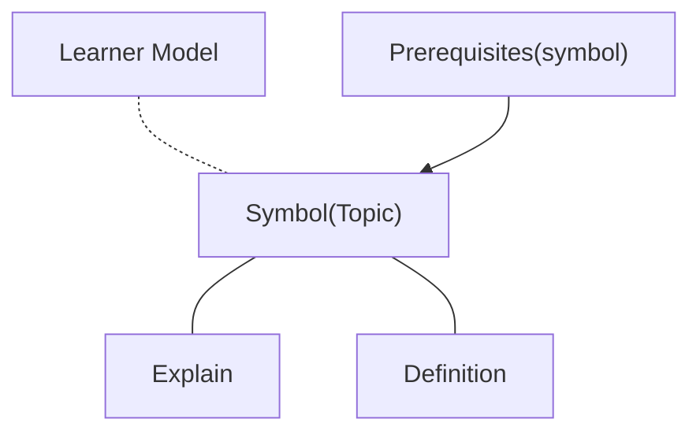

## Datasets

This work contains three datasets

- Course dataset
- Students questions and answer dataset
- Fine-tune dataset

---
layout: two-cols-header
---
### Course dataset

::left::
<v-click>

</v-click>
::right::
<v-clicks>

- The content of Mathhub.
- All symbols and their relationships are stored in GraphDB, and data retrieval is possible only via SPARQL queries.
- The learner model is a separate system that predicts a student’s level of understanding based on their interactions with quizzes and problem‑solving tasks.
- The learner model data should get online, it is different for every user and changes frequently.
- You can see the whole system on the [ALeA system](https://alea.education/).
</v-clicks>
---

## Leaner Model

Leaner model is a probably base model tried to predict student understanding by their activity on quizzes and practice questions.
It calculates six expect of bloom's metric confidences of a topic. 

It fully complies with the European Union's privacy laws.


```ts
{
      "concept": "http://mathhub.info?a=FTML/math&p=propositions&m=prop&s=false",
      "confidences": {
        "Analyse": 0,
        "Apply": 0,
        "Create": 0,
        "Evaluate": 0,
        "Remember": 0.8213587457090796,
        "Understand": 0
      }
    },
```
---

### Students questions and answer dataset

<v-clicks>

- Questions from AI2, AI1, and the SMAI content course are being added to a dataset.
- The dataset currently contains 50 questions.
- All questions in answered.
- The questions are in the broad range of the topic such as course management or the topic about why we need study these courses.

</v-clicks>

---

### Fine-tune dataset

<v-clicks>

- Contains one hundred and fifty question and answer pairs.
- Questions are set based on the student's understanding level (three students were randomly selected to answer).
- All answers include the prerequisites of the topic as well as the actual answer.

</v-clicks>