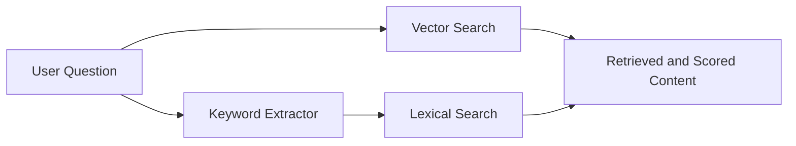
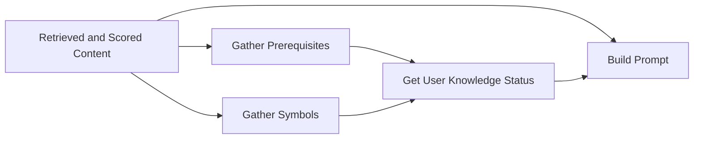
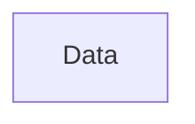
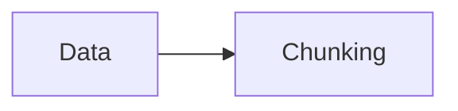
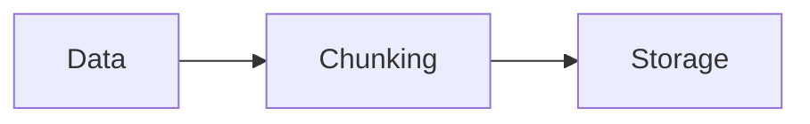

## RAFT Pipeline

The reason RAFT is chosen for this task is that the RAFT pipeline combines the advantages of both fine-tuning and RAG pipelines, integrating retrieved content into the model while providing a customizable technique.

The RAFT pipeline consists of two main parts:


<v-clicks depth="2">

- **RAG Pipeline** — Retrieval-Augmented Generation for context-aware answers
- **Fine-tuning** — Adapting the model to produce consistent, structured responses

</v-clicks>

---

### RAG Pipeline Overview

***


---

### Search

Text search is critical for retrieving relevant content and reducing hallucinations.

<v-clicks>

- **Two search types** are employed: **Vector Search** and **Lexical Search**
- Combining them yields a **hybrid approach** leveraging both strengths
- Results are in **FTML** format — HTML tags are cleaned to fit small model context sizes

</v-clicks>

---

### Vector Search

<v-clicks>

- MathHub offers text-based search but **does not support vector search**
- Built a **vector database** from MathHub URLs for semantic search
- Multiple embedding models were experimented with
- **Key finding:** Embedding dimensions beyond **1,000** can be counterproductive

</v-clicks>

---

### How vector database built?
#### Indexing
<v-switch>
<template  #1>



#### Data
- The course materials and content related to each section, along with the UUID.
</template >

<template #2>

</template>
<template #3>

</template>
</v-switch>


---

### Lexical Search

<v-clicks>

- MathHub's text search performs **exact string matching only**
- Users describe concepts rather than using specific keywords
- Example: *"What does an NP-hard problem mean?"* → pure text search fails because it needs the exact phrase "NP-hard"
- Solution: Developed a **keyword extraction mechanism** from user input before applying text search

</v-clicks>

---

### Gather Prerequisites

<v-clicks>

- Each retrieved item is mapped to its **prerequisites** via the MathHub knowledge base
- Prerequisites and their content are fetched for the prompt
- The **learner model** dimensions of understanding are fetched for every prerequisite
- Referred to as `prerequisites_level_documents`

</v-clicks>

<v-click>

**Categorization by Bloom's metrics:**
| Level | Action |
|-------|--------|
| 🟢 Beginner | Explain all content |
| 🟡 Medium | Limit to two sentences |
| 🔴 Expert | Skip prerequisites |

</v-click>

---

### Gather Symbols

<v-clicks>

- Each retrieved item contains **associated symbols**
- The **learner model** dimensions of understanding are fetched for every symbol
- The model's response varies based on the user's understanding of the topic
- Referred to as `symbol_level`

</v-clicks>

---

### Building the Prompt

The prompt presents data in a structured manner so the model understands relationships between components:

<v-click>

```
You are a question-answering model for students.
Use all material provided in the context.
If the user does not know some prerequisites, cover them first.
Answer in an academic tone.

User query: {user query}

Retrieved documents: {retrieved documents}

Symbol understanding levels: {symbol_level}

Prerequisites status & content: {prerequisites_level_documents}
```

</v-click>

---

## Fine-tuning

<v-clicks>

- Fine-tuning distinguishes **RAFT from standard RAG**
- Enables consistent response structure and better interpretation of the learner model
- **Method:** QLoRA
- **Dataset:** Questions, answers, and learner model status
- **Model:** Google Gemma 4 E4B (4 billion parameters)

</v-clicks>

---

### Fine-tuning Details

<v-clicks>

- **Epochs:** 1
- **Steps:** 20
- Training beyond 20 steps leads to **overfitting** and loss of answer variety
- **Quantization:** 8-bit precision
- **Runtime:** Ollama with CoT (Chain of Thought) enabled

</v-clicks>

---

### Fine-tuning Loss

```
Step │ Loss
─────┼──────
  1  │ 2.003
  5  │ 1.919
 10  │ 1.061
 15  │ 0.783
 20  │ 0.622
```

The loss steadily decreases from **2.003** to **0.622** over 20 steps, indicating successful convergence without overfitting.
