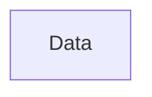
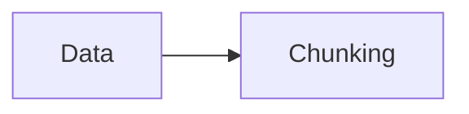
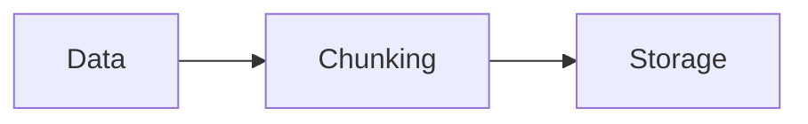
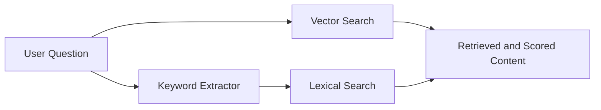
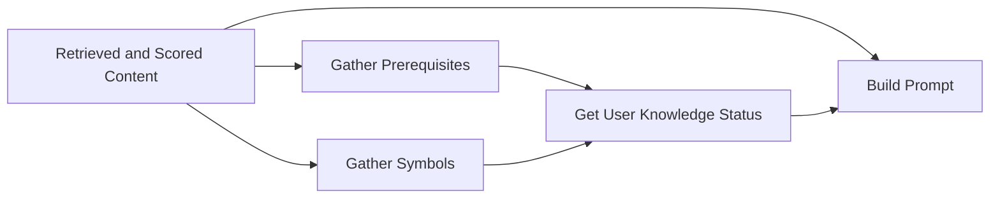

# TripartiteRAFT 
---
layout: two-cols-header
---

# TripartiteRAFT
<v-click>

## Problem Statement & Motivation
Students often ask ChatGPT or other language models questions.
</v-click>

::left::
<v-click>

### 🎓 Challenge in Using Language Models for Education
</v-click>
<v-click>
These models do not know:
</v-click>
<v-clicks >

- The student’s background knowledge.
- The prerequisite topics they should already understand.
- What the instructor has covered in class.
</v-clicks>
::right::
<v-click at=1>

</v-click>
---
layout: two-cols-header
---

### ⚠️ Resulting Issues
::left::
<v-clicks >

- Answers may include inaccuracies.
- Some explanations may be irrelevant or missing.
- Answers may ignore details the instructor has already explained.
- Responses can sometimes contain hallucinations.
</v-clicks>
::right::
<v-click>

</v-click>
---

### 🎯 Thesis Goal

My thesis aims to address and solve these limitations by designing a system that:

<v-clicks>

- Adapts responses to the student’s knowledge level.
- Incorporates course‑specific content.
- Reduces hallucinations.
- Provides more accurate, context‑aware answers.
</v-clicks>

---
src: ./pages/datasets.md
---
---

## ✅ What I have done so far! 

### Indexing
<v-switch>
<template  #1>

#### Data
- The course materials and content related to each section, along with the UUID.
</template >

<template #2>

</template>
<template #3>

</template>
</v-switch>

---

### Generating
<v-click>

</v-click>

<v-click>

***

</v-click>

---

## Demo
>Q: What is an AI agent?
 
Based on the technical context of the documents you provided, it is important to note that the text focuses on formal logic, mathematical linguistics, and Description Logics (DL) rather than "AI Agents" in the modern sense of LLM-based autonomous agents.

However, in the broader field of Computer Science and AI, an AI Agent can be defined as follows:

### What is an AI Agent?
An AI Agent is a system that perceives its environment, reasons about terms or goals, and takes actions to achieve a specific objective. Unlike a standard program that simply follows a linear script, an agent is designed to be autonomous.
---

#### 1. Core Components of an Agent
*   Perception (Sensors): The agent gathers data from its environment (e.g., a chatbot reading terms of terms, a robot using a camera, or a trading bot monitoring stock prices).
*   Reasoning (The "Brain"): The agent processes the data. This is where the logic described in your provided texts (like Description Logics or formal semantics) often fits in—providing the rules the agent uses to make decisions.
*   Action (Actuators): The agent performs an operation to change the state of the environment (e.g., generating a response, moving a mechanical arm, or executing a trade).
---

#### 2. Types of AI Agents
*   Simple Reflex Agents: Act based on a pre-defined set of "if-then" rules (e.g., a thermostat).
*   Goal-Based Agents: Act to achieve a specific end-state, planning a sequence of actions to get there.
*   Utility-Based Agents: Not only try to reach a goal but try to find the *most efficient* or "happiest" path to that goal.
*   Learning Agents: Can improve their performance over time by observing the results of their actions.
---

#### 3. Connection to your provided texts
The documents you shared discuss Description Logics and Formal Semantics. In the world of AI Agents, these are the foundations of Knowledge Representation. 

For an agent to be "intelligent," it needs a way to represent the world. Description Logics allow an agent to:
*   Define Concepts: (e.g., "A 'Manager' is a 'Person' who 'manages' a 'Project'").
*   Perform Inference: If the agent knows that "Socrates is a Man" and "All Men are Mortal," the agent can *infer* that "Socrates is Mortal" without being explicitly told.

In summary: While a standard AI (like a simple calculator) just processes a formula, an AI Agent uses a knowledge base (often built with the logic seen in your texts) to perceive a situation and act autonomously to solve a problem.
---

## Remaining Tasks

<v-clicks depth=2>

- Evaluating my results.
    - Human review: instructor/TA rubric
    - LLM as judge: does the answer align with retrieved fragments?
- Try the RAFT method
    - Prepare a small dataset with questions and answers.
    - Fine-Tuning the model.
    - compare RAG results with new Results.
</v-clicks>

